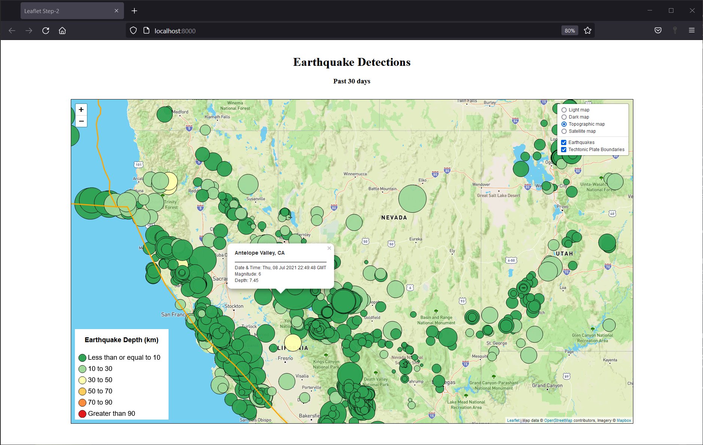

# leaflet-challenge
UofA Data Analytics Bootcamp Homework Assignment 17-Leaflet

### Assignment Description
Build a responsive webpage map showing USGS recorded earthquakes for the past 30 days.

### Tools Utilized
| Webpage | User Interface |
|----------|----------|
| HTML | Javascript |
| CSS | D3.js |
| | Leaflet |

### Project Content Descriptions
* a_assignment_instructions: Instructions, data and starter code for completing the assignment.
* b_techtonicplates-master: Techtonic plate source data.
* c_Leaflet-Step-1: project code for base assignment
    * static/css: CSS style sheets for the webpage.
    * static/scripts: Javascript code for building the interactive webpage.
    * index.html: HTML code for the interactive webpage.
* d_Leaflet-Step-2: project code for bonus assignment
    * static/css: CSS style sheets for the webpage.
    * static/scripts: Javascript code for building the interactive webpage.
    * index.html: HTML code for the interactive webpage.
* e_images: Webpage screenshots.
* LICENSE: MIT License Disclosure

### Run Instructions
1. Open terminal
    
    a. Navigate to the c_Leaflet-Step-1 or d_Leaflet-Step-2 folder
    
    b. Rename static/jss/config_template.js as static/jss/config.js
    
    c. Add mapbox.com API key to static/jss/config.js
    
    d. Run "python -m http.server" 

2. Open browser

    a. Navigate to <a href="http://localhost:8000/" target="_blank">http://localhost:8000/</a>
    
    b. Hover over the earthquake circles to see detailed earthquake data.
    
    c. Click on different map display options to select view of interest.

### Completed Bonus Webpage (d_Leaflet-Step-2)
Webpage upon initial load

Webpage after user selections

### Source Data and Starter Code
* Starter code provided by UofA Data Analytics Bootcamp
* USGS Earthquake Data from <a href="https://earthquake.usgs.gov/earthquakes/feed/v1.0/geojson.php" target="_blank">https://earthquake.usgs.gov/earthquakes/feed/v1.0/geojson.php</a>
* Tectonic plate data from <a href="https://github.com/fraxen/tectonicplates" target="_blank">https://github.com/fraxen/tectonicplates</a>